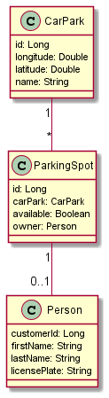

# Car park management

This Car park management system is for companies, who have to keep track of several car parks.
The Application can provide them information about the amount of available parking spots, or the location of the car parks.

If they provide these informations to their customers, the customers can always find a narrow free parking spot which
saves time and is good for the environment

### Class Diagram

